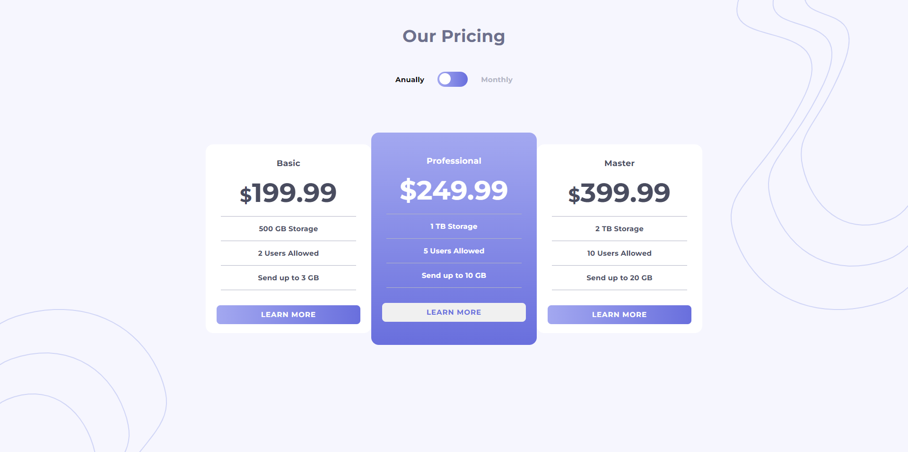
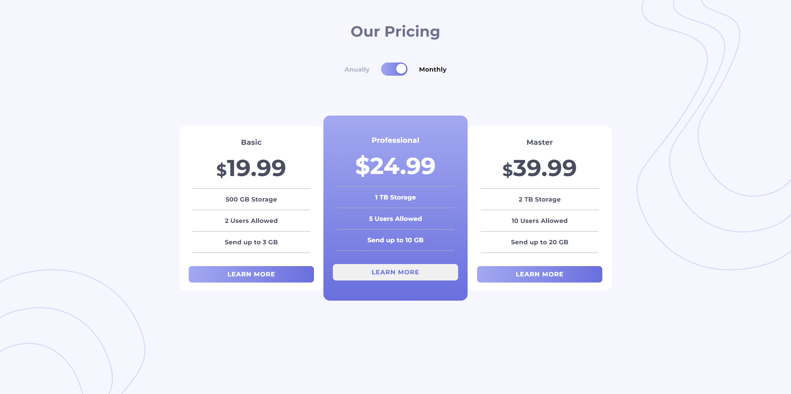

# Frontend Mentor - Pricing component with toggle solution

This is a solution to the [Pricing component with toggle challenge on Frontend Mentor](https://www.frontendmentor.io/challenges/pricing-component-with-toggle-8vPwRMIC). Frontend Mentor challenges help you improve your coding skills by building realistic projects. 

## Table of contents

- [Overview](#overview)
  - [The challenge](#the-challenge)
  - [Screenshot](#screenshot)
  - [Links](#links)
- [My process](#my-process)
  - [Built with](#built-with)
  - [What I learned](#what-i-learned)
  - [Continued development](#continued-development)
- [Author](#author)


## Overview

### The challenge

Users should be able to:

- View the optimal layout for the component depending on their device's screen size
- Control the toggle with both their mouse/trackpad and their keyboard
- **Bonus**: Complete the challenge with just HTML and CSS

### Screenshot





### Links

- Live Site URL: (https://tengxuanp.github.io/pricing-component-with-toggle-master/)


### Built with

- Semantic HTML5 markup
- CSS custom properties
- Flexbox
- CSS Grid
- Mobile-first workflow
- [React](https://reactjs.org/) - JS library


### What I learned


I learned how to use useState to change CSS style & className:

```js
<p className="toggle__p" style={{color:monthly?'':'black'}}>Anually</p>
    <div className={`toggle__bg-anually${monthly? '-off' : ''}`}>
      <input className="toggle__switch" type="checkbox" onClick={()=>setMonthly(!monthly)} />
    </div>
```


### Continued development

The project is not perfect, I will continue to:
1. Correct the toggle hover animation
2. Make toggling animation


## Author
- Frontend Mentor - [@tengxuanp](https://www.frontendmentor.io/profile/tengxuanp)